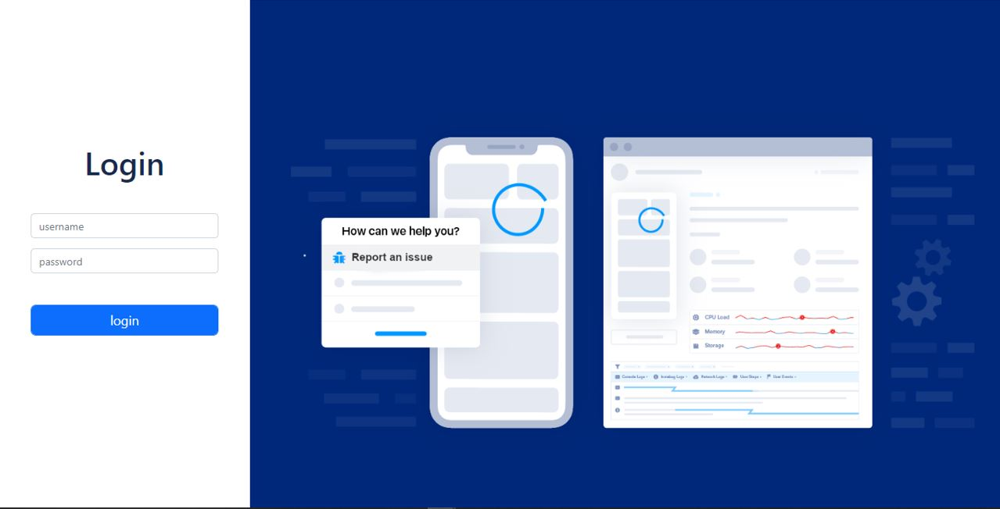

# Issue Tracker

A Convenient Way for Clients to Report Issues with Software.

## Table of contents

* [General info](#general-info)
* [Screenshot](#screenshot)
* [Technologies](#technologies)
* [Languages](#languages)
* [Features](#features)
* [Inspiration](#inspiration)
* [Developers](#developers)

## General info

A web application that enables clients to report issues. The platform interact with JIRA to push issues as bugs to the associated projects.

## Screenshot

## Technologies

* Node and Node Package Manager
* Git & GitHub
* Express
* Postgres
* HTML
* CSS
* React

## Languages

* JavaScript

## Features

The GUI entails three forms, a login UI, a client UI and an administrator UI.

The Login UI allows clients / users to:
* Receive an email with login details to the platform.
* Access the platform for the first time.
* Be prompted to set a new password.

The Client UI allows users to:
* Report issues.
* Enter a form which accept issue title (required), description (required), screenshot (optional).

The Admin UI allows Admin to:
* Invite / register a client.
* View all assigned clients with the following details: (ID, name, email, organisation).
* Edit clients and archive clients.

The API's used are the following:
* Cloudinary api
* Twilio api with sendgrid
* Jira api with jira-connector
Refer to the Swagger docs for more info.

## Status

First release.

## Inspiration

This was a capstone project that climaxed the graduate trainee program by Amalitech Ghana. It was a challenge that we faced with excitement, as this was a huge opportunity to put what we had learned during the program into practice. The thrill of building a whole system from scratch also served as a great form of motivation.

## Developers

[Kabral Alluekeh](https://github.com/Kabral12)

[Aaron Acheampong](https://github.com/Aaron-Acheampong)
